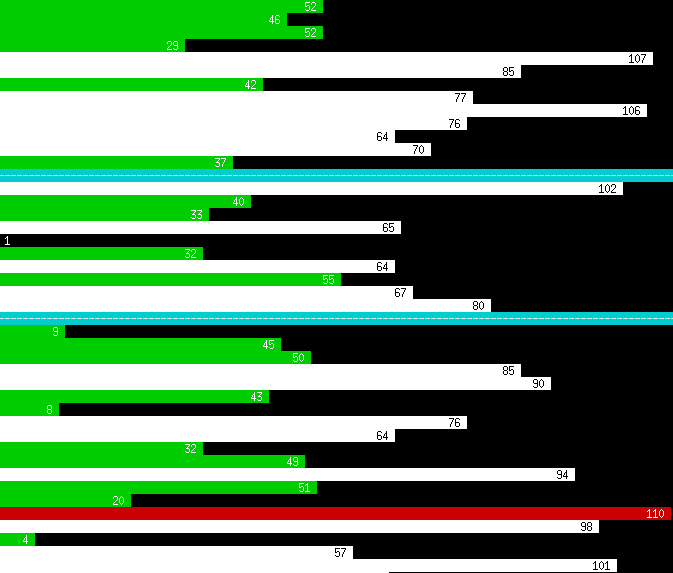

# LiveLine

LiveLine is the PoC of a stream visualizer for the command line.

These are the conventions:

- An incoming data point is rendered as a bar on a new line on stdout
  including its numerical value on the head of the bar.
- The data point's goodness is indicated by its color:
  + **green**: optimal
  + **white**: normal
  + **red**: critical

  The thresholds for *optimal*, *normal* and *critical* data points are
  customizable by the user.
- A separator line (full width, **blue**) can be used to indicate a
  predefined meta-event (like the change of the input channel of the data
  etc.). Multiple separator line types (mutliple colors) are possible; too
  many are confusing.
- Input values are scaled accordingly to fit between 0 and the width of the
  terminal that is dynamically determined (at startup or before each new
  line is printed to stdout). A linear scale makes sense, but other scales
  are possible, if the data allows it.
- Buffering is advised.

## PoC

        python liveline.py

It merely shows how the output could look like. **This is not a working
prototype.**

## WARNING

1. IO is slow. The terminal may not be the right place to output data from
   streams with high frequency!
2. The terminal emulator's backlog buffer ("scroll buffer") has to be
   limited to a sane size!
